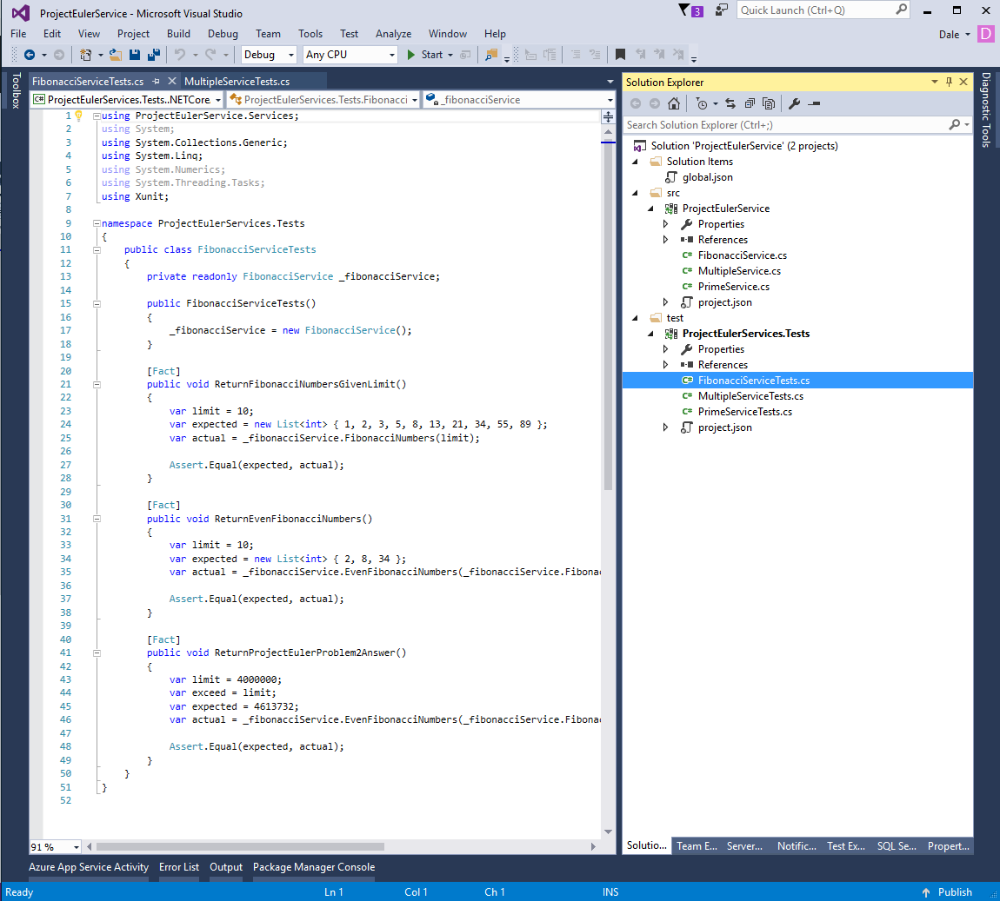

# Project Euler Service
This is a class/test library solely for my purpose in learning .Net core and solving the problems from [Project Euler](https://projecteuler.net/archives).

## Getting Started
If you would like to run the tests locally clone the repository and use the test explorer in Visual Studio 2015 to run the tests.

*Note you will need .NET core installed.

